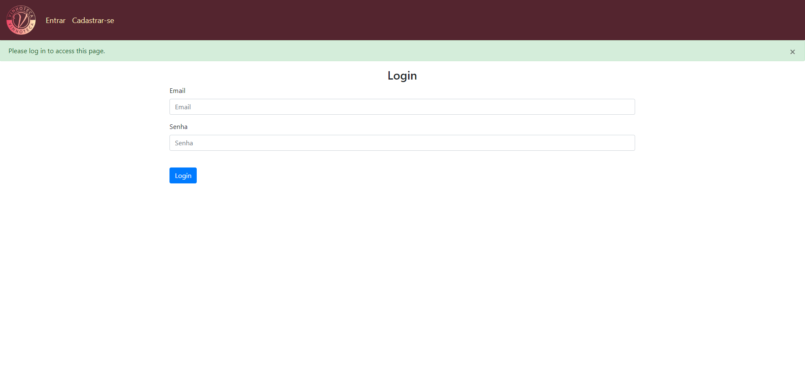

# Flask Web App Tutorial

## Setup & Installation

Make sure you have the latest version of Python installed.

```bash
git clone <repo-url>
```

```bash
pip install -r requirements.txt
```
Flask version: 2.3.3
```bash
pip3 install --force-reinstall -v "flask==2.3.3"
```
werkzeug version: 2.3
```bash
pip3 install --force-reinstall -v "werkzeug==2.3"
```

## Running The App

```bash
python main.py
```

## Viewing The App

Go to `http://127.0.0.1:5000`


The project in question is a cellar organization system. The system can be used by common users or by companies, including
restaurants and stores, to quickly organize your collections. In the case of companies, it is possible to provide assistance
to customers who arrive without know a lot about wines.

# Login Page



# Sign-in Page


# My wine cellar


# New wine registration page


# Wine pairing page


